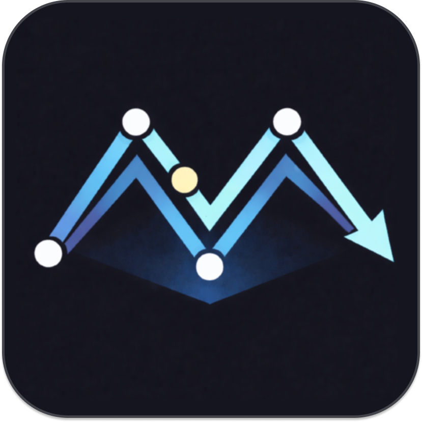
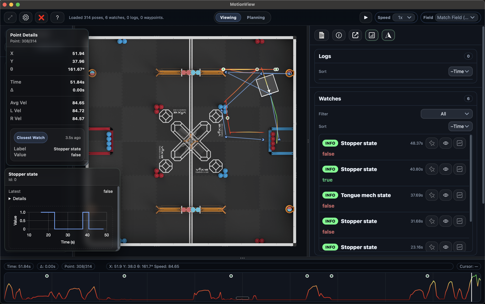

# MotionView Docs

    
    
    |
    
    

    

MotionView's creation was inspired by other visualizers such as [Grafana](https://github.com/UZ9/pros-grafana-cli) and [Graphy](https://github.com/jazonshou/Graphy). Our goal was to create a high-performance versatile VRC dashboard that is packed full of features, easy to use, and easy to understand.

 

**MotionView is a high-speed telemetry dashboard and live visualizer for VEX PROS teams.** It turns a raw stream of terminal numbers into a highly visual, actionable representation of your robot's behavior. Stop guessing why your robot is failing, and start seeing it.

    

## Core Features
- **Live Streaming:** See your robot's exact path, heading, and speed drawn on a virtual 2D field.
- **Compare and Contrast:** Overlay multiple datasets (such as actual and target velocities) on the graph at once.
- **Customizable UI:** Pin critical variables as custom floating UI widgets, and drag floating widgets around the screen.
- **Path Planning:** Draft, edit, and simulate routes interactively, then overlay your planned path onto a real recorded run.
- **Smart Telemetry:** Create periodic set-and-forget watches and stream general-purpose logs over a high-speed binary protocol without eating up your V5 CPU.
- **Events are synced:** Click on an event to see exactly where and what the robot was doing at that time.

## Quick Start
1. **Download:** Grab the latest release for your OS from the [Releases Page](https://github.com/lewispinstein-hue/MotionView/releases).
2. **Demo:** In older versions (v1.2.0 and earlier, newer versions have a built-in demo), download the [`Example Route`](MotionView_Example.json), press `Cmd + O` in MotionView to open it, and press `Space` to watch a recorded run (Note this is a VEX Pushback run, as the current season is still to early for an actual Override demo).
3. **Connect your Robot:** Install [MVLib](MVLib/README.md) into your PROS project to start streaming your own live data.

## Docs
- [MotionView Docs](Docs/MotionView)
- [MVLib Docs](Docs/MVLib)

## Keybinds
UX designed to keep your hands on the keyboard. Use the built-in keybinds to navigate MotionView. You can also view them inside MotionView through the help menu.

  
Keybinds

  <table>
    <thead>
      <tr> <th>Context</th> <th>Keybind</th> <th>Action</th> </tr>
    </thead>
    <tbody>
      <tr> <td>Global</td> <td><code>Cmd + 1</code></td> <td>Switch to Viewing mode</td> </tr>
      <tr> <td>Global</td> <td><code>Cmd + 2</code></td> <td>Switch to Planning mode</td> </tr>
      <tr> <td>Global</td> <td><code>Cmd + Shift + K</code></td> <td>Clear everything (field + plan)</td> </tr>
      <tr> <td>Global</td> <td><code>F</code></td> <td>Fit/reset field position</td> </tr>
      <tr> <td>Global</td> <td><code>T</code></td> <td>Toggle Floating info panel</td> </tr>
      <tr> <td>Viewing</td> <td><code>Space</code></td> <td>Play/Pause playback (or toggle Auto‑follow Head when live‑connected)</td> </tr>
      <tr> <td>Viewing</td> <td><code>Cmd + O</code></td> <td>Open file selector</td> </tr>
      <tr> <td>Viewing</td> <td><code>Cmd + K</code></td> <td>Clear Viewer</td> </tr>
      <tr> <td>Viewing</td> <td><code>Cmd + S</code></td> <td>Start/stop live streaming (if connected)</td> </tr>
      <tr> <td>Viewing</td> <td><code>Cmd + R</code></td> <td>Refresh & sync livestream (if streaming)</td> </tr>
      <tr> <td>Viewing</td> <td><code>P</code></td> <td>Toggle Planned Overlay</td> </tr>
      <tr> <td>Viewing</td> <td><code>G</code></td> <td>Toggle Floating Graph</td> </tr>
      <tr> <td>Viewing</td> <td><code>Cmd + C</code></td> <td>Connect/disconnect</td> </tr>
      <tr> <td>Viewing</td> <td><code>←</code> / <code>→</code></td> <td>Step to previous/next pose</td> </tr>
      <tr> <td>Planning</td> <td><code>Space</code></td> <td>Play/Pause plan playback</td> </tr>
      <tr> <td>Planning</td> <td><code>Delete</code> / <code>Backspace</code></td> <td>Delete selected waypoint(s)< td> </tr>
      <tr> <td>Planning</td> <td><code>←</code> / <code>→</code> / <code>↑</code> / <code>↓</code></td> <td>Nudge selected waypoint(s)</td> </tr>
      <tr> <td>Planning</td> <td><code>Shift + ←/→/↑/↓</code></td> <td>Nudge selected waypoint(s) by 5× step</td> </tr>
      <tr> <td>Planning</td> <td><code>Cmd + Z</code></td> <td>Undo</td> </tr>
      <tr> <td>Planning</td> <td><code>Cmd + Shift + Z</code></td> <td>Redo</td> </tr>
      <tr> <td>Planning</td> <td><code>Cmd + K</code></td> <td>Clear planned path</td> </tr>
    </tbody>
  </table>

---

## Version Compatibility

> **How to check your versions:**
> * **MotionView:** Click the `?` icon in the app, and look for the version number in the bottom left.
> * **MVLib:** Run `pros c info-project` in your terminal and look for `libmvlib`.

Because MotionView and MVLib communicate using a highly optimized binary protocol, you must ensure your desktop app and your PROS library are compatible. 

| MotionView App | Requires MVLib | Notes |
| :--- | :--- | :--- |
| **v1.3.x** | **v3.0.x**   **v2.0.x** | Latest release |
| **v1.2.x** | **v2.0.x** | Introduced high-speed binary telemetry. |
| **v1.1.x** | **v1.1.x** | Non-binary data protocol |
| **v1.0.x** | **v1.0.x** | Legacy data protocol (missing some features) |