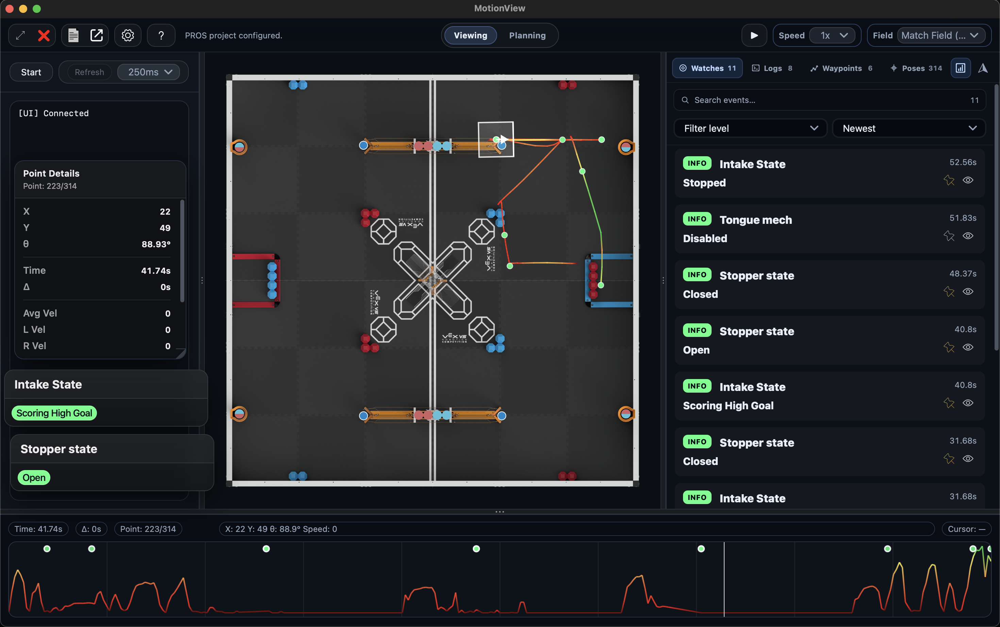

# MotionView Docs

<table style="border-collapse: separate; border-spacing: 0; border: 1px solid #d0d7de; border-radius: 6px; width: auto; font-family: -apple-system, BlinkMacSystemFont, 'Segoe UI', Helvetica, Arial, sans-serif;">
  <tr>
    <!-- Repository Stats -->
    <td style="padding: 10px 16px; vertical-align: middle; border-right: 1px solid #d0d7de;">
      
      
    </td>
    <!-- Versions -->
    <td style="padding: 10px 16px; vertical-align: middle;">
      
      
    </td>
  </tr>
</table>

    

MotionView's creation was inspired by other visualizers such as [Grafana](https://github.com/UZ9/pros-grafana-cli) and [Graphy](https://github.com/jazonshou/Graphy). Our goal was to create a high-performance versatile VRC dashboard that is packed full of features, easy to use, and easy to understand.

 

**MotionView is a high-speed telemetry dashboard and live visualizer for VEX PROS teams.** It turns a raw stream of terminal numbers into a highly visual, actionable representation of your robot's behavior. Stop guessing why your robot is failing, and start seeing it.

    

## Core Features
- **Live Streaming:** See your robot's exact path, heading, and speed drawn on a virtual 2D field.
- **Compare and Contrast:** Overlay multiple datasets (such as actual and target velocities) on the graph at once.
- **Customizable UI:** Pin critical variables as custom floating UI widgets, and drag floating widgets around the screen.
- **Path Planning:** Draft, edit, and simulate routes interactively, then overlay your planned path onto a real recorded run.
- **Smart Telemetry:** Create periodic set-and-forget watches and stream general-purpose logs over a high-speed binary protocol without eating up your V5 CPU.
- **Events are synced:** Click on an event to see exactly where and what the robot was doing at that time.

## Quick Start
1. **Download:** Grab the latest release for your OS from the [Releases Page](https://github.com/lewispinstein-hue/MotionView/releases).
2. **Connect your Robot:** Install `MVLib` into your PROS project to start streaming your own live data.

## Send feedback directly through the app
Open the help menu (the `?` in the top left corner) and select "Send Feedback" in the bottom right corner.
Anything helps! We're always looking for ways to improve MotionView.

---

## Version Compatibility

> **How to check your versions:**
> * **MotionView:** Click the `?` icon in the app, and look for the version number in the bottom left.
> * **MVLib:** Run `pros c info-project` in your terminal and look for `libmvlib`.

Because MotionView and MVLib communicate using a highly optimized binary protocol, you must ensure your desktop app and your PROS library are compatible. 

| MotionView App | Requires MVLib | Notes |
| :--- | :--- | :--- |
| **v1.3.x** | **v3.0.x**   **v2.0.x** | Latest release |
| **v1.2.x** | **v2.0.x** | Introduced high-speed binary telemetry. |
| **v1.1.x** | **v1.1.x** | Non-binary data protocol |
| **v1.0.x** | **v1.0.x** | Legacy data protocol (missing some features) |
