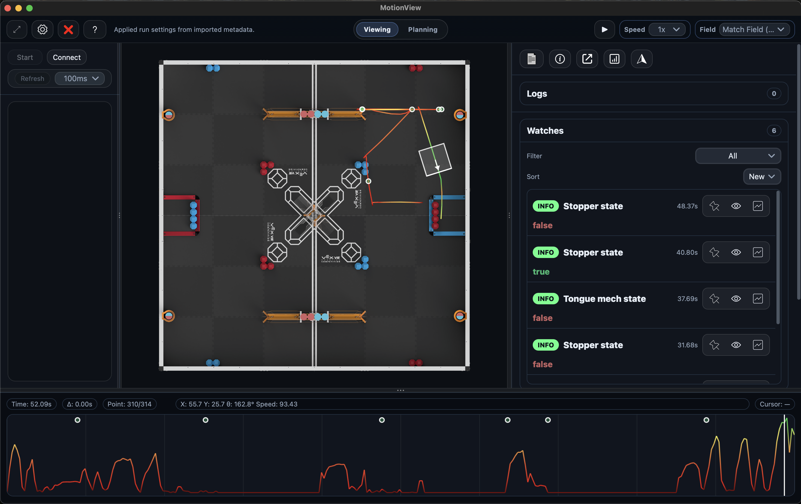
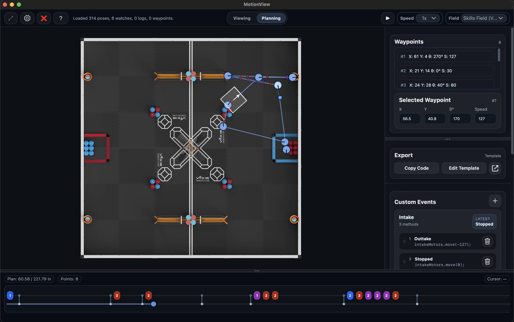

# MotionView - Live Robot Visualizer

    

## What is MotionView?
MotionView is a live visualizer for PROS robots. It turns a stream of numbers into a visual insight into your robot's behavior. It lets you see the robot's position, speed, and events on a live updating dashboard.

    

## Quick Start
1. Open MotionView.
2. Use `Cmd + O` to open a file.
3. Download (from this GitHub) & Select the [`Example Route`](MotionView_Example.json) to see a full demo route with poses and watches.
4. Press `Space` to play/pause and hover the field to inspect pose + watch details.

**Main features:**
- Load recorded runs and see the robot path instantly.
- Scrub the timeline and inspect pose, speed, and watch values.
- Switch to Planning mode to draft, compare, and edit a path.
- Livestream runs with one click
- Upload your own Robot image to use instead of a plain box

## Why MotionView?
- **Built for PROS teams**: fast to learn, practical for testing.
- **Pose + watch aware**: path, pose, and other important values all in one view.
- **Live or Later**: stream from the robot or open a saved file.
- **Decision-friendly**: compare runs, spot issues, and iterate faster.

## There are two main modes: 
### Viewing Mode
Use this mode to **replay and analyze** a run.

    

What you see:
- The field canvas draws the robot path, heading, and live pose playback so you can confirm movement shape, orientation, and speed at each timestamp.
- A timeline scrubber/keyboard stepping lets you jump to specific poses, pause on key moments, or fast-forward to the end of the run.
- The floating info island mirrors the current pose or live update, surfacing pose (x/y/theta), left and right wheel speeds, and the last watch values without needing to hover the field.
- The watches list tallies timed signals (solenoids, pneumatics, etc.) so you can filter for the events that matter. See the [main docs](/Docs/MVLib/Watches.md) for more info.
- Waypoints list. Allows you to create a waypoint that you can use for auton analyzing or driver practice. See the [main docs](/Docs/MVLib/Waypoints.md) for more info.
- Logs list. This is of your custom logs. It can be sorted through. See the [main docs](/Docs/MVLib/StandardLog.md) for more info.
 
Key controls:
- Refresh button and interval animate the view on a set cadence when streaming, or you can tap Refresh to pull the latest poses/watches immediately; think of it as reloading the live buffer so the UI matches the source data.
Key capabilities:
- Overlay the planned path or a previous run to compare intent versus execution.
- Toggle live streaming to keep the field updating in real time when connected to a robot, or use file import (`Cmd + O`) to review saved logs.
- Use play/pause, step forward/back, and fit/reset (`F`) to keep attention on the most important moments.

### Planning Mode
Use this mode to **plan and refine** a path before testing, or after.

    

What you interact with:
- Drop waypoints on the field and drag them to adjust radii/positions; each waypoint represents a target pose or action in the plan.
- A specialist timeline shows the planned motion playback, letting you inspect how long the plan takes and how smoothly the robot turns.
- The plan editor exposes undo/redo (`Cmd + Z`/`Cmd + Shift + Z`), nudging with arrow keys, and multiple selection for batch adjustments.

Key capabilities:
- Play back the plan exactly like a recorded run to inspect timing, heading changes, and acceleration before running on the robot.
- Export the plan as JSON or overlay it in Viewing mode to compare with recorded telemetry.
- Clear the plan (`Cmd + K`) to start fresh, or use nudging shortcuts (Shift + arrows for 5× steps) for micro precision.

## Prerequisites
MotionView requires nothing out of the box to load files, but some features require external dependencies. 
1. **Live streaming:** This feature requires you to have both a PROS Project locally on your computer, and to have the [`PROS Extension`](https://marketplace.visualstudio.com/items?itemName=sigbots.pros) installed through `VS Code` or `Cursor`.

## Live Streaming
Live streaming allows you to:
- A live-updating field view with the current pose, heading, and speed so you can monitor motion as it happens.
- Watch values appear alongside poses, showing sensor states, pneumatics, or other telemetry the logger emits.
- A timeline lets you scrub through the poses and watch values, or step forward/backward in real time.

Some use cases:
- Warm up the robot and verify that the logger is working before grabbing a file.
- Compare live motion to saved plans to confirm sensors/fire sequences are firing when expected.
- Capture a run simply by letting it stream and exporting to save the generated log afterward for later review.

## Keybinds

**Legend:** `Cmd` on macOS, `Cmd` means `Ctrl` on Windows/Linux.

| Context | Keybind | Action |
|---|---|---|
| Global | `Cmd + 1` | Switch to Viewing mode |
| Global | `Cmd + 2` | Switch to Planning mode |
| Global | `Cmd + Shift + K` | Clear everything (field + plan) |
| Global | `F` | Fit/reset field position |
| Global | `T` | Toggle Floating info panel |
| Viewing | `Space` | Play/Pause playback (or toggle Auto‑follow Head when live‑connected) |
| Viewing | `Cmd + O` | Open JSON file |
| Viewing | `Cmd + K` | Clear Viewer |
| Viewing | `Cmd + S` | Start/stop live streaming (if connected) |
| Viewing | `Cmd + R` | Refresh & sync livestream (if streaming) |
| Viewing | `P` | Toggle Planned Overlay |
| Viewing | `G` | Toggle Floating Graph |
| Viewing | `Cmd + C` | Connect/disconnect |
| Viewing | `←` / `→` | Step to previous/next pose |
| Planning | `Space` | Play/Pause plan playback |
| Planning | `Delete` / `Backspace` | Delete selected waypoint(s) |
| Planning | `←` / `→` / `↑` / `↓` | Nudge selected waypoint(s) |
| Planning | `Shift + ←/→/↑/↓` | Nudge selected waypoint(s) by 5× step |
| Planning | `Cmd + Z` | Undo |
| Planning | `Cmd + Shift + Z` | Redo |
| Planning | `Cmd + K` | Clear planned path |

## Version Compatibility

> **How to check your versions:**
> * **MotionView (Desktop App):** Click the `?` icon in the app and look in the bottom left corner.
> * **MVLib (PROS Library):** Run `pros c info-project` in your terminal and look for `libmvlib` in the output.

Because MotionView and MVLib communicate using a custom data protocol, you must ensure your desktop app and your PROS library are compatible. 

We highly recommend always updating to the latest versions for both. MVLib `v2.0.0` introduced binary logging which massively improves logging latency and bandwidth. It is essential to be using versions newer than/or `v2.0.0`

| MotionView App | Requires MVLib | Notes |
| :--- | :--- | :--- |
| **v1.2.x** | **v1.1.x**   **v2.0.0** | Current Latest Release |
| **v1.1.x** | **v1.1.x** | Altered data protocol |
| **v1.0.x** | **v1.0.x** | Legacy data protocol (missing some features) |
